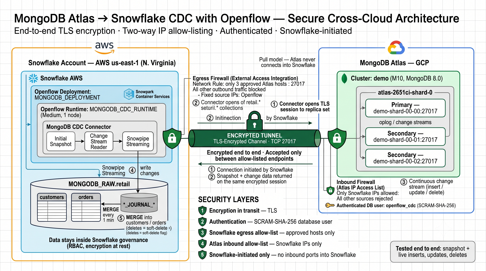

# Openflow: MongoDB Atlas → Snowflake (CDC)

Near real-time replication of MongoDB Atlas collections into Snowflake using the Openflow Connector for MongoDB on a Snowflake deployment (SPCS). Covers initial snapshot plus live inserts, updates and deletes through change streams, across clouds (Atlas on GCP, Snowflake on AWS), with TLS, SCRAM authentication and two-way IP allow-listing.



## Contents
- [DEPLOYMENT.md](DEPLOYMENT.md): step-by-step deployment guide (Atlas setup, Snowflake SQL, connector configuration in the UI, validation, troubleshooting)
- [stream_to_mongo.py](stream_to_mongo.py): optional load generator for testing live CDC

## Quick start for the optional streaming test
```bash
pip install pymongo
export MONGO_URI="mongodb+srv://<cluster-host>/?authSource=admin"
export MONGO_USER="<user>" MONGO_PASSWORD="<password>"
python stream_to_mongo.py --interval 1 --batch 5
```
